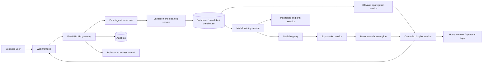

# Enterprise-Scale Architecture Extension

## Why this is needed

The implemented Streamlit application demonstrates the research workflow locally. A production or enterprise version would require separation of responsibilities, governance, monitoring and secure access control.

## Proposed architecture



## Enterprise controls

| Requirement | Prototype evidence | Enterprise extension |
|---|---|---|
| Data ingestion | CSV/Excel/JSON/ZIP/API upload | Data connectors, data lake, scheduled ingestion |
| Data quality | Cleaning report and missing-value analysis | Validation rules, data contracts, quality monitoring |
| Model governance | Model leaderboard and metrics | Model registry, approval workflow, versioning |
| Explainability | SHAP/fallback explanation | Explanation service and cached explanation records |
| Business recommendations | Controlled Business Insight Engine | Policy-managed recommendation engine |
| Safety | Human-review warnings | Audit logs, approvals, access roles, monitoring |
| Scale | Local sampling and aggregation | Backend jobs, distributed processing, database queries |

## Future reinforcement-learning extension

Reinforcement learning or contextual bandits should only be added when the system has real action-outcome feedback:

```text
state → business action → outcome/reward → updated policy
```

Example:

```text
customer risk profile → retention offer → customer retained/not retained → reward
```

The current prototype does not implement RL because public static datasets normally do not contain reliable action/reward histories.
